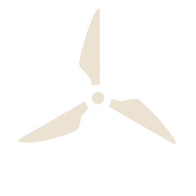

# memefpv.net

The MemeFPV website. Plain HTML, CSS and one small JavaScript file — **no build step**.
Edit a file, save it, commit in GitHub Desktop, and it's live in about a minute.

---

## What's in here

| File | What it is |
|---|---|
| `index.html` … `contact.html` | One file per page. Eight pages plus `404.html`. |
| `style.css` | All the styling for the whole site. |
| `site.js` | Just the mobile menu button. |
| `assets/` | Images, video, logo, icons. |
| `CNAME` | Tells GitHub Pages the site lives at memefpv.net. **Don't delete this.** |
| `robots.txt`, `sitemap.xml` | Help Google index the site. |
| `site-audit.md`, `migration-checklist.md`, `handoff.md` | Notes from the migration. Not part of the live site. |

---

## How to preview changes before pushing

Double-click `index.html` — it opens in your browser and works exactly like the live site.
Refresh after every save.

---

## Common edits

### Change some words on a page

Open the `.html` file for that page and find the text. Everything between `<p>` and `</p>`
is a paragraph; between `<h1>`/`<h2>`/`<h3>` is a heading. Change the words, leave the tags alone.

### Replace a dashed placeholder box with a real photo

Every placeholder tells you what image it wants and what size. Find the block:

```html
<div class="placeholder" style="aspect-ratio: 1 / 1;">Add a still from an event shoot<br>(square, ~800&times;800)</div>
```

Drop your photo into `assets/`, then replace that whole line with:

```html

```

Keep photos under about 300 KB each — resize before adding them, or the site gets slow.

### Add a YouTube video to the Drone Work page

Find a placeholder like this in `drone-work.html`:

```html
<div class="placeholder">YouTube embed &mdash; Lazy River MX<br><small>Paste the video ID into the iframe (see README)</small></div>
```

Replace that whole line with the block below, swapping `VIDEO_ID` for the code at the end of
the YouTube URL (in `youtube.com/watch?v=dQw4w9WgXcQ`, the ID is `dQw4w9WgXcQ`):

```html
<div class="embed">
  <iframe src="https://www.youtube.com/embed/VIDEO_ID" title="Video title here"
          loading="lazy" allowfullscreen></iframe>
</div>
```

### Change a color

Open `style.css`. The first block at the top holds every color the site uses:

```css
--bg:     #181818;   /* page background */
--text:   #ebe2d2;   /* body text */
--accent: #e8442a;   /* MemeFPV red */
```

Change one there and it updates everywhere.

### Add or rename a page in the menu

The menu is written into **all eight HTML files** (that's the trade-off for having no build
step). If you change it, change it in every file — search for `<nav class="nav"` and copy the
same block across. Same goes for the footer.

---

## The logo — there are two

**MEME WORKS** is the site mark. It's on every page except one:

```html
<span class="wordmark">MEME <span class="works">WORKS</span></span>
```

**MEMEFPV with the spinning propeller** belongs to `drone-work.html` only — header and
footer. That page's `<body>` carries `class="page-fpv"`, which is what the CSS keys off:

```html
<span class="wordmark">MEME<span class="fpv">FPV</span></span>

```

Both are plain text plus (on the drone page) one image, styled in `style.css` under
`/* Logo */`. `MEME` is off-white, `WORKS` and `FPV` are the brand red. The header is a fixed
height on every page so the nav doesn't jump when you move between the two marks.

The propeller also stays as the **favicon** everywhere — it's the site's icon at 16px, where
a wordmark would be unreadable.

The spin animation lives *inside* `assets/prop.svg`. To change its speed, open that file and
edit `1.8s` in the line `animation: prop-spin 1.8s linear infinite`. Lower = faster.
It stops automatically for visitors who have "reduce motion" turned on.

### Social share images

`assets/og-default.jpg` (MEME WORKS) is used everywhere; `assets/og-drone.jpg` (MEMEFPV) is
used on `drone-work.html`. These are what show up when someone pastes a link into a text.

---

## The pages

| Page | What it's for |
|---|---|
| `index.html` | Home — the through-line, and the four areas |
| `about.html` | About Mike |
| `what-i-do.html` | The three things you take on for hire |
| `drone-work.html` | Aerial work + the builds behind it — **the only page using the MEMEFPV mark** |
| `3d-prints.html` | Printing and prototyping |
| `rc-builds.html` | RC cars and bench builds |
| `homelab.html` | Servers, networking, self-hosting |
| `workshop.html` | The workshop and bench build — linked from the home page only, not in the nav yet |
| `contact.html` | Email, Instagram, project form |

## Before launch — still to do

- [ ] Publish the Microsoft Form and paste its URL into `contact.html` (search for `href="#"`)
- [ ] Confirm `info@memefpv.net` receives mail
- [ ] Replace the dashed placeholders with real photos
- [ ] Add the YouTube embeds on `drone-work.html`
- [ ] Point memefpv.net's DNS at GitHub Pages, then wait for the SSL certificate
- [ ] Cancel Squarespace once the new site is confirmed live

---

## Deploying

Commit and push in GitHub Desktop. GitHub Pages redeploys automatically.
Nothing to build, nothing to run.
